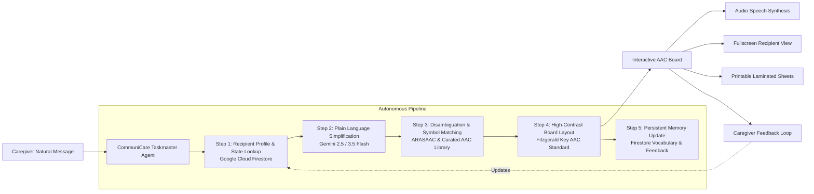

# CommuniCare
**Autonomous Agent Pipeline Transforming Caregiver Messages into High-Contrast AAC Picture Symbol Boards**

Built for the **Google All Things Agentic Hackathon** — *Taskmaster Track*.

[](https://www.python.org/)
[](https://github.com/google/generative-ai-python)
[](https://cloud.google.com/run)
[](https://en.wikipedia.org/wiki/Fitzgerald_Key)
[](LICENSE)

---

## 🌟 The Problem & Operational Utility

Caregivers who support nonverbal or speech-limited individuals repeatedly face the same mental friction throughout the day:
1. Simplifying natural sentences into plain concepts.
2. Searching for appropriate AAC (Augmentative and Alternative Communication) picture symbols.
3. Formatting and assembling a visual communication board.

This chore is mentally taxing, repetitive, and slows down vital moments when clarity and immediate communication matter most.

**CommuniCare** removes this translation step completely. A caregiver enters a normal spoken or written message, and CommuniCare's autonomous agent pipeline transforms it into a ready-to-use, accessible, high-contrast picture symbol board — adapting dynamically to the care recipient's learned vocabulary and preferences stored in **Firestore**.

---

## 🏗️ Architecture & Pipeline Flow



---

## 🛠️ Required Google Technology Stack

| Google Technology | Role in CommuniCare |
| :--- | :--- |
| **Gemini 2.5 / 3.5 Flash** | Plain language simplification, concept extraction, and grammatical reasoning via `google-genai` SDK. |
| **Google Cloud Firestore** | Persistent per-recipient memory: tracks learned vocabulary, success counters, and personalized symbol preferences across sessions. |
| **Google Cloud Run** | Serverless production hosting environment with containerized deployment (`Dockerfile`, `cloudbuild.yaml`). |
| **ARASAAC AAC Library** | Open-license (CC BY-NC-SA) picture symbol catalog with zero-latency vector pictograms and graceful text-card fallback. |

---

## 🚀 Quickstart & Spin-up Instructions

### Prerequisites
- Python 3.11+
- Git
- Google Gemini API Key (optional for offline testing — built-in heuristic reasoning active if key omitted)

### 1. Clone & Set Up Virtual Environment
```bash
git clone https://github.com/your-username/CommuniCare.git
cd CommuniCare

# Create and activate virtual environment
python -m venv venv
# On Windows:
.\venv\Scripts\activate
# On Linux/macOS:
source venv/bin/activate
```

### 2. Install Dependencies
```bash
pip install -r requirements.txt
```

### 3. Configure Environment Variables (Optional)
Copy `.env.example` to `.env` and add your keys:
```bash
cp .env.example .env
```
Edit `.env`:
```ini
GEMINI_API_KEY=your_gemini_api_key_here
GOOGLE_CLOUD_PROJECT=your_gcp_project_id
PORT=8080
```

### 4. Run the Application Locally
```bash
python -m uvicorn communicare.main:app --host 0.0.0.0 --port 8080 --reload
```
Open your browser to: **`http://localhost:8080`**

---

## 🧪 Running Automated Tests
Run the comprehensive test suite verifying the agent pipeline, Firestore state persistence, symbol resolvers, and REST endpoints:
```bash
python -m pytest tests/ -v
```

---

## 🎯 2-Turn Adaptive Demonstration (Judging Showcase)

To see the autonomous personalization in action:
1. Click **✨ 2-Turn Adaptive Demo** in the top navigation bar.
2. **Turn 1**: CommuniCare processes a morning routine message for *Leo* (`"Good morning Leo! Please take your medicine with a glass of water..."`).
3. **Reinforcement**: The caregiver marks the medicine and pancakes symbols as *Worked Well*.
4. **Turn 2**: A new message (`"Leo, remember to take your afternoon medicine before we go for a walk"`) is processed. The pipeline automatically loads the preference from Firestore memory and tags the board with: `✨ Personalized preference applied from memory`.

---

## 🚢 Google Cloud Run Deployment

Deploy directly to Google Cloud Run:

```bash
# Set your GCP Project
gcloud config set project YOUR_PROJECT_ID

# Build and deploy using Google Cloud Build
gcloud builds submit --config cloudbuild.yaml .

# Or deploy directly with gcloud run
gcloud run deploy communicare \
  --source . \
  --region us-central1 \
  --platform managed \
  --allow-unauthenticated \
  --set-env-vars GEMINI_API_KEY=YOUR_KEY,GOOGLE_CLOUD_PROJECT=YOUR_PROJECT_ID
```

---

## ♿ Accessibility & Clinical Standards (Fitzgerald Key)

CommuniCare utilizes the clinical **Fitzgerald Key** color-coding standard for augmentative communication:
- 🟨 **Yellow**: People / Pronouns (I, You, Doctor, Caregiver)
- 🟩 **Green**: Verbs / Actions (Eat, Drink, Walk, Sleep, Wash)
- 🟧 **Orange**: Nouns / Objects / Food (Medicine, Water, Pancakes, Park, Dog)
- 🟦 **Blue**: Adjectives / Descriptors (Big, Small, Quiet, Calm)
- 🟪 **Purple**: Time / Schedule (Morning, Night, Now, Later)
- 🌸 **Pink**: Social / Feelings (Happy, Hurt, Help, Yes, No)

---

## 📄 Open-Source License & Symbol Attribution
- Software code licensed under the [MIT License](LICENSE).
- AAC Pictograms sourced under Creative Commons (CC BY-NC-SA 3.0) from [ARASAAC](https://arasaac.org), authored by Sergio Palao for the Government of Aragon.
