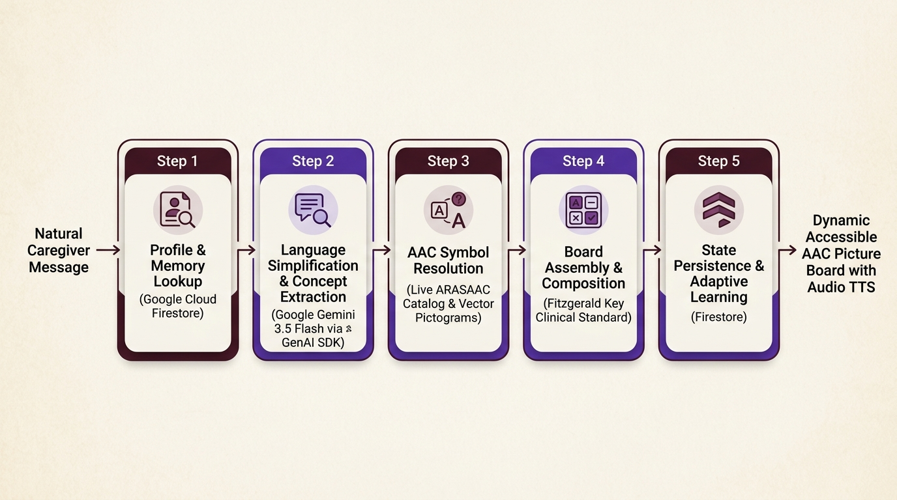
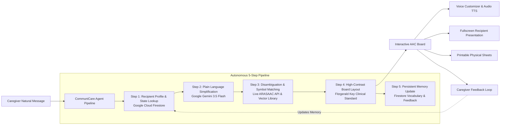

# CommuniCare
**Autonomous Agent Pipeline Transforming Caregiver Messages into High-Contrast AAC Picture Symbol Boards**

Built for the **Google All Things Agentic Hackathon** — *Taskmaster Track*.

[](https://www.python.org/)
[](https://github.com/google/generative-ai-python)
[](https://cloud.google.com/run)
[](https://en.wikipedia.org/wiki/Fitzgerald_Key)
[](LICENSE)

---

## 🌟 The Problem & Clinical Utility

Caregivers supporting nonverbal or speech-limited individuals repeatedly face the same mental friction throughout the day:
1. Simplifying natural spoken instructions into core concepts.
2. Searching symbol libraries for appropriate visual pictograms.
3. Assembling, coloring, and formatting a communication board.

This chore is mentally taxing, repetitive, and slows down crucial daily routines when clarity and immediate communication matter most.

**CommuniCare** removes this translation barrier completely. A caregiver enters a normal spoken or written message, and CommuniCare's autonomous agent pipeline transforms it into a ready-to-use, high-contrast picture symbol board in under one second — personalizing vocabulary and symbols dynamically based on individual recipient history stored in **Google Cloud Firestore**.

---

## 🤖 Google Agent Framework & Technology Stack

> **Compliance Statement**: CommuniCare is built natively with the official **Google GenAI SDK (`google-genai`)** as its agent reasoning engine and orchestrator.

| Google Technology | Role in CommuniCare |
| :--- | :--- |
| **Google GenAI SDK (`google-genai`)** | Primary Agent Framework driving the 5-step autonomous pipeline, structured reasoning, and schema enforcement. |
| **Google Gemini 3.5 Flash** | Plain language simplification, concept extraction, intent classification, and grammatical categorization. |
| **Google Cloud Firestore** | Persistent per-recipient memory: tracks learned vocabulary, success counters, and personalized symbol preferences across sessions. |
| **Google Cloud Run** | Serverless production hosting environment with containerized deployment (`Dockerfile`, `cloudbuild.yaml`). |
| **ARASAAC Pictogram Library** | Open-license (CC BY-NC-SA 3.0) picture symbol catalog with live REST API resolution, vector SVGs, and graceful text fallbacks. |

---

## 🏗️ Architecture & Pipeline Flow





---

## 🚀 Quickstart & Spin-Up Instructions

### Prerequisites
- Python 3.11+
- Git
- Google Gemini API Key (optional for offline evaluation — built-in heuristic reasoning engine activates automatically if omitted)

### 1. Clone & Set Up Virtual Environment
```bash
git clone https://github.com/your-username/CommuniCare.git
cd CommuniCare

# Create and activate virtual environment
python -m venv venv

# On Windows (PowerShell):
.\venv\Scripts\activate

# On Linux/macOS:
source venv/bin/activate
```

### 2. Install Dependencies
```bash
pip install -r requirements.txt
```

### 3. Configure Environment Variables (Optional)
Copy `.env.example` to `.env`:
```bash
cp .env.example .env
```
Edit `.env` if using a live Gemini API key:
```ini
GEMINI_API_KEY=your_gemini_api_key_here
GEMINI_MODEL=gemini-3.5-flash
GOOGLE_CLOUD_PROJECT=your_gcp_project_id
PORT=8080
```

### 4. Run the Application Locally
```bash
python -m uvicorn communicare.main:app --host 0.0.0.0 --port 8080 --reload
```
Open your browser to:
- **Landing Page**: `http://localhost:8080/`
- **Interactive Studio**: `http://localhost:8080/app`

---

## 🧪 Running Automated Tests
Run the comprehensive 19-test suite verifying the agent pipeline, multi-turn memory adaptation, symbol resolvers, and REST endpoints:
```bash
python -m pytest tests/ -v
```

---

## 🎯 Multi-Turn Adaptive Demonstration (Judging Showcase)

To evaluate the autonomous personalization:
1. Navigate to `http://localhost:8080/app` and click **✨ Adaptive Memory Demo** in the top navigation bar.
2. **Turn 1**: CommuniCare processes a morning routine message for *Leo* (`"Good morning Leo! Please take your medicine with a glass of water, then we will have warm pancakes for breakfast."`).
3. **Reinforcement**: The caregiver reinforces the `medicine` and `pancakes` symbols using the *"👍 Worked Well"* action.
4. **Turn 2**: An afternoon message (`"Leo, remember to take your afternoon medicine before we go for a walk."`) is processed. The pipeline autonomously retrieves the learned preference from Firestore and tags the board with: `✨ Personalized preference applied from memory`.

---

## 🚢 Google Cloud Run Production Deployment & Security

> **Security Rule**: The `.env` file holding the `GEMINI_API_KEY` is explicitly git-ignored and must **never** be committed to the repository. The key must be injected at deploy time via Google Cloud Secret Manager or Cloud Run environment variables so that the deployed service actively routes through Gemini 3.5 Flash rather than dropping into the local fallback.

### Option A: Deploy with Google Cloud Secret Manager (Recommended)
```bash
# 1. Create the secret in GCP Secret Manager
echo -n "YOUR_GEMINI_API_KEY" | gcloud secrets create gemini-api-key --data-file=-

# 2. Grant Secret Accessor role to the Cloud Run service account
gcloud secrets add-iam-policy-binding gemini-api-key \
  --member="serviceAccount:$(gcloud projects describe YOUR_PROJECT_ID --format='value(projectNumber)')-compute@developer.gserviceaccount.com" \
  --role="roles/secretmanager.secretAccessor"

# 3. Deploy to Cloud Run mounting the secret
gcloud run deploy communicare \
  --source . \
  --region us-central1 \
  --platform managed \
  --allow-unauthenticated \
  --set-env-vars GOOGLE_CLOUD_PROJECT=YOUR_PROJECT_ID,GEMINI_MODEL=gemini-3.5-flash \
  --set-secrets GEMINI_API_KEY=gemini-api-key:latest
```

### Option B: Deploy with Direct Environment Variables
```bash
gcloud run deploy communicare \
  --source . \
  --region us-central1 \
  --platform managed \
  --allow-unauthenticated \
  --set-env-vars GEMINI_API_KEY="YOUR_GEMINI_API_KEY",GEMINI_MODEL="gemini-3.5-flash",GOOGLE_CLOUD_PROJECT="YOUR_PROJECT_ID"
```

### Verifying Live Gemini Activation on Cloud Run:
After deployment, verify that the service is actively communicating with Gemini 3.5 Flash:
```bash
curl https://YOUR_SERVICE_URL.run.app/api/health
```
Expected response:
```json
{
  "status": "healthy",
  "service": "CommuniCare Agent Platform",
  "gemini_active": true,
  "gemini_model": "gemini-3.5-flash",
  "system_status": "Operational"
}
```

---

## ♿ Accessibility & Clinical Standards (Fitzgerald Key)

CommuniCare structures communication boards using the clinical **Fitzgerald Key** color standard:
- 🟨 **Yellow**: People / Pronouns (I, You, Doctor, Caregiver)
- 🟩 **Green**: Verbs / Actions (Eat, Drink, Walk, Sleep, Wash)
- 🟧 **Orange**: Nouns / Objects / Food (Medicine, Water, Pancakes, Park, Dog)
- 🟦 **Blue**: Adjectives / Descriptors (Big, Small, Quiet, Calm)
- 🟪 **Purple**: Time / Schedule (Morning, Night, Now, Later)
- 🌸 **Pink**: Social / Feelings (Happy, Hurt, Help, Yes, No)

---

## 📄 Open-Source License & ARASAAC Attribution

- Software codebase licensed under the [MIT License](LICENSE).
- **ARASAAC Attribution**: The pictographic symbols used in CommuniCare are property of the Government of Aragón and have been created by Sergio Palao for [ARASAAC](https://arasaac.org), which distributes them under the Creative Commons License (CC BY-NC-SA 3.0).
